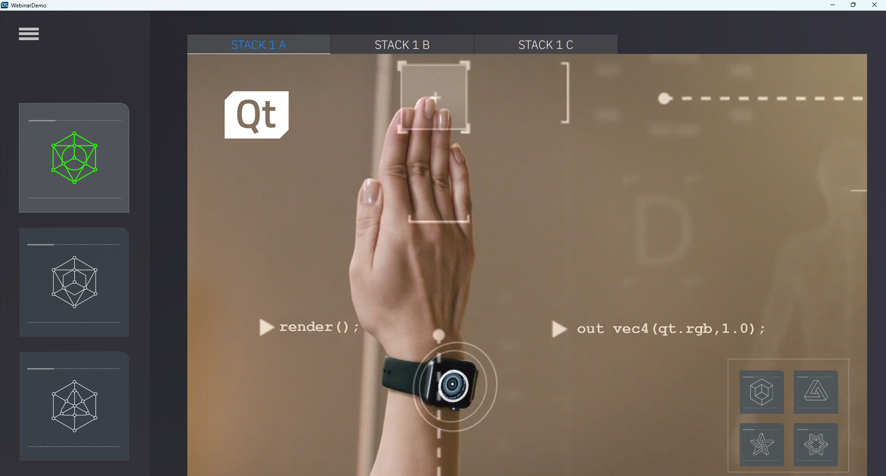

# Webinar Demo

The Webinar Demo contains the source files for the From Photoshop to Prototype with Qt Design Studio webinar that shows how to export designs from Adobe Photoshop to Qt Design Studio and to edit them to create a UI. Learn more about this demo [here](https://doc.qt.io/qtdesignstudio/qtdesignstudio-webinardemo-example.html).

## Requirements

The example works with QDS (4.x) and has been tested in Qt Creator with Qt 6.8.2 but it should also work with earlier versions of Qt.

## Running

The Webinar Demo can be run either from Qt Design Studio or by exporting the application using "Enable CMake Generator" in Qt Design Studio and opening the generated CMakeLists.txt file in QtCreator.

## Target Environments

All desktop platforms.
